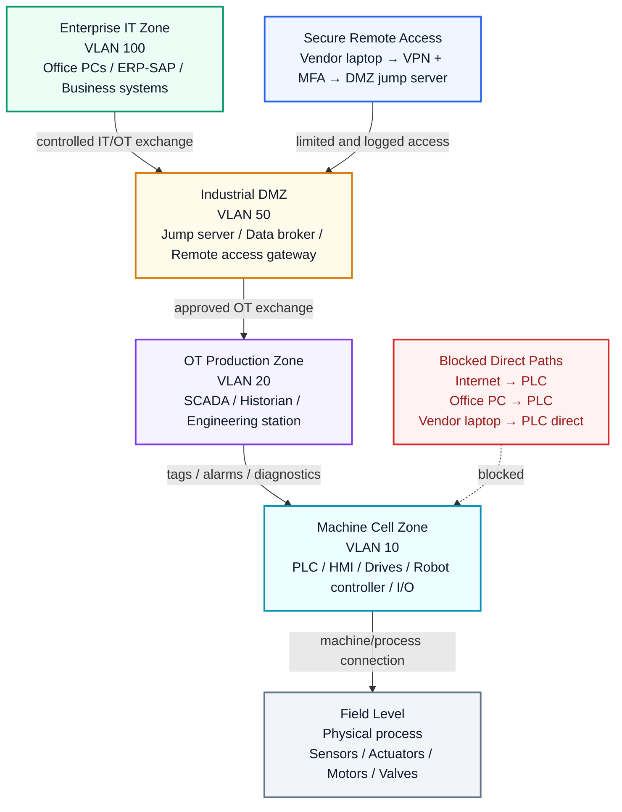

# Industrial IT/OT Network Architecture

A conceptual reference design for segmented factory connectivity, controlled production data exchange, and secure remote access in PLC-based production environments.

## Architecture Overview



## Purpose

This project documents a simplified industrial IT/OT network architecture for a PLC-based production environment. It focuses on network segmentation, controlled communication between zones, production data flow, and secure remote access.

The design is vendor-neutral and conceptual. It can be used as a public portfolio reference for automation engineering, industrial networking, IT/OT connectivity, and production-data-related roles.

## Architecture Zones

| Zone | Example VLAN / Subnet | Typical Systems | Purpose |
|---|---:|---|---|
| Enterprise IT Zone | VLAN 100 / 10.10.1.0/24 | Office PCs, ERP/SAP, business servers, databases | Business systems, planning, and reporting |
| Industrial DMZ | VLAN 50 / 10.10.50.0/24 | Jump server, data broker, remote access gateway | Controlled buffer between IT and OT |
| OT Production Zone | VLAN 20 / 192.168.20.0/24 | SCADA, historian, engineering station | Production monitoring, engineering, and data collection |
| Machine Cell Zone | VLAN 10 / 192.168.10.0/24 | PLC, HMI, drives, robot controller, I/O devices | Direct machine control |
| Field Level | Device-specific / fieldbus | Sensors, actuators, motors, valves | Physical production process |

## Core Design Principle

Allow only required communication, document each conduit, and block direct uncontrolled access to PLCs and machine networks.

## Main Production Data Flow

```text
Field Level
Sensors / Actuators
        ↓
PLC
        ↓
HMI / SCADA
        ↓
Historian / Database
        ↓
MES
        ↓
ERP / SAP
```

## Secure Remote Access Concept

Remote access should not go directly to PLCs or machine networks.

Recommended structure:

```text
Vendor laptop
        ↓
VPN with multi-factor authentication
        ↓
Firewall
        ↓
DMZ jump server
        ↓
Firewall
        ↓
Required OT system
```

Remote access should be authenticated, limited, logged, monitored, and restricted to required systems.

## Documentation

- [Architecture Report](docs/architecture_report.md)
- [Data Flow and Remote Access](docs/data_flow_and_remote_access.md)
- [Assumptions and Limitations](docs/assumptions_and_limitations.md)
- [Device / IP / VLAN Plan](tables/device_ip_vlan_plan.md)
- [Communication Matrix](tables/communication_matrix.md)
- [Firewall Rule Examples](tables/firewall_rule_examples.md)

## Scope

This is a conceptual reference architecture, not a complete production implementation. Real projects require plant-specific network design, security review, firewall rule validation, redundancy planning, change management, and operational approval.
